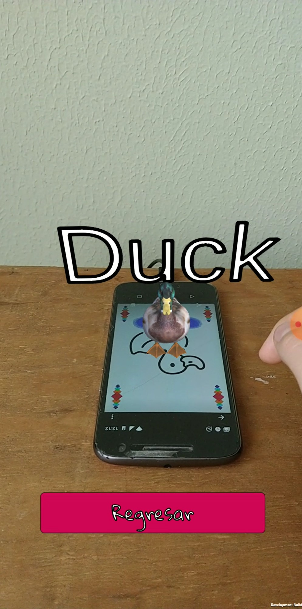
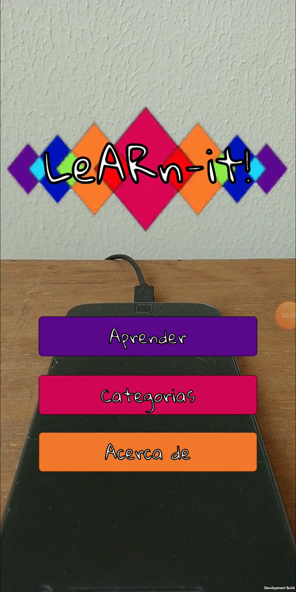

# LeARn-it

Es una aplicacion que con la implementación de AR enseñar a los niños otros idiomas de forma didáctica y completa, asociando imagenes con palabras y sonidos.

## Tarjetas de AR

Las tarjetas diseñadas especialmente para su fácil detección y para llamar la atención de los niños, manteniendo un diseño simple. 

## Escalabilidad

Las tarjetas se diseñan al rededor de un tema o una categoria, asi que es poible agregar más tarjetas por medio de estos.

## La aplicación

Es necesario contar con Android 7.0 o superior para poder ejecutar la aplicaicón.

## Proyecto

Para ejecutar el proyecto solo hay que abrir el la carpeta *leARn-it* del proyecto con Unity versión 2019.3.1f1